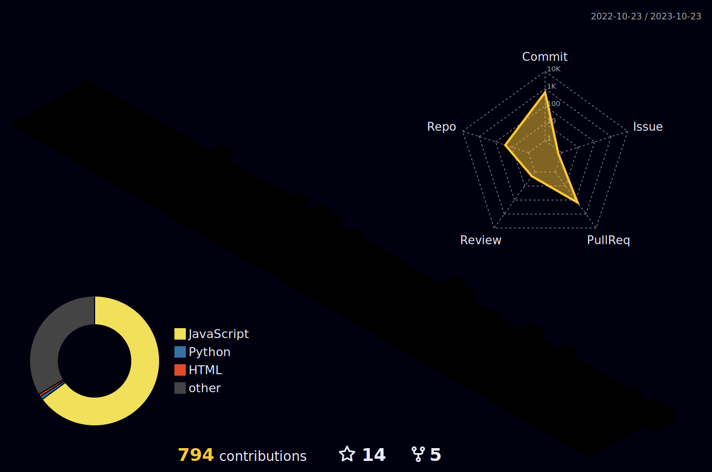

<!-- Introduction -->
<h1 align="center">Hi 👋, I'm Asad</h1>

  
  

  

  

<!-- About me -->
- 🔭 I’m currently working as a **Mern Stack Developer**
- 🌱I’m currently learning **BlockChain**
- 👯 I’m looking to collaborate on **open source projects**
- 🤝 I’m also looking to work and collaborate with other **Teach Enthusiasts** and **Developers**
- 💬 Ask me about **MERN Stack and Blockchain Development**
- 📫 How to reach me: **asadulhaq543@gmail.com**
- 💎 Let's get connected!

<!-- Social media and website links -->
<h3 align="center">Connect with me:</h3>

  
  
  
  

<!-- Skills and Tools -->
<h2 align="center">Languages and Tools</h2>

These are some of the languages and tools that I am familiar with and have worked with in the past. 

<table>
  <tr>
    <th style="color: #61DAFb">Stats</th>
    <th>Streak</th>
    <th>Languages</th>
  </tr>
  <tr>
    <td></td>
    <td></td>
    <td></td>
  </tr>
</table>

<h4 align="center">Isometric view of contributions in the last year</h4>

  

